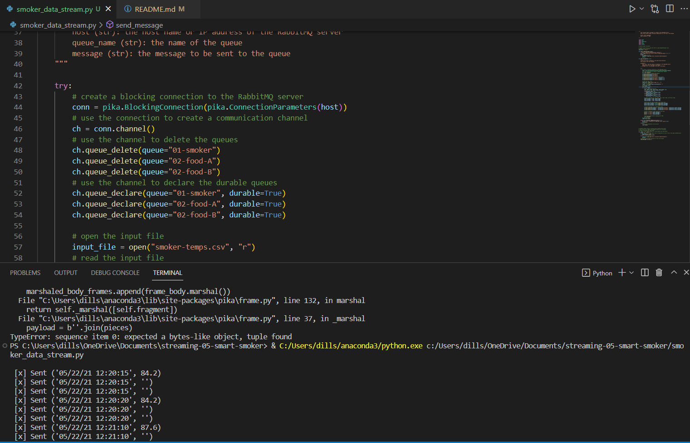

# streaming-05-smart-smoker

## Dylan Eggemeyer, Module 5 Assignment
Created February 8, 2023

## Prerequisites
* Python 3.10 or newer installed
* Ability to execute python scripts

## Stream Smoker Data
Run smoker_data_stream.py to simulate a stream of smoker temperature data every 30 seconds.

## Screenshot
This shows the producer running and sending messages
